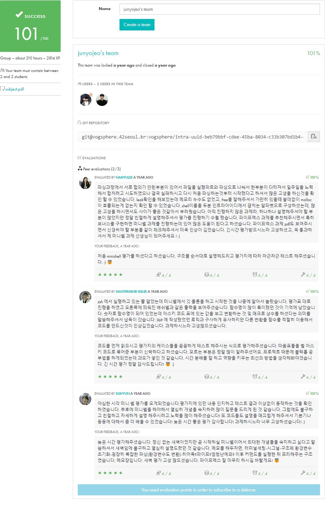
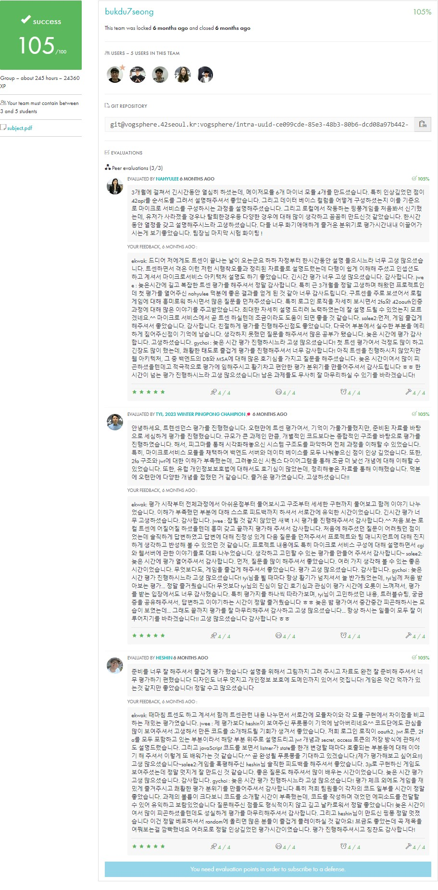

## 소개

본 레포지토리는 42Seoul 교육과정에서 수행한 프로젝트들을 집대성한 포트폴리오입니다. 각 프로젝트의 상세 정보와 코드 리뷰를 확인하실 수 있습니다.

## 목차
- [기술 스택 개요](#기술-스택-개요)
- [프로젝트 목록](#프로젝트-목록)
  - [00. link_tree](#00-link_tree)
  - [01. Libft](#01-libft)
  - [02. get_next_line](#02-get_next_line)
  - [03. Born2beroot](#03-born2beroot)
  - [04. ft_printf](#04-ft_printf)
  - [05. push_swap](#05-push_swap)
  - [06. FdF](#06-fdf)
  - [07. minitalk](#07-minitalk)
  - [08. Philosophers](#08-philosophers)
  - [09. minishell](#09-minishell)
  - [10. NetPractice](#10-netpractice)
  - [11. cub3d](#11-cub3d)
  - [12. CPP Module 00](#12-cpp-module-00)
  - [13. CPP Module 01](#13-cpp-module-01)
  - [14. CPP Module 02](#14-cpp-module-02)
  - [15. CPP Module 03](#15-cpp-module-03)
  - [16. CPP Module 04](#16-cpp-module-04)
  - [17. CPP Module 05](#17-cpp-module-05)
  - [18. CPP Module 06](#18-cpp-module-06)
  - [19. CPP Module 07](#19-cpp-module-07)
  - [20. CPP Module 08](#20-cpp-module-08)
  - [21. CPP Module 09](#21-cpp-module-09)
  - [22. Inception](#22-inception)
  - [23. ft_irc](#23-ft_irc)
  - [24. ft_transcendence](#24-ft_transcendence)
- [연락처](#연락처)

## 기술 스택 개요

- **프로그래밍 언어**: C, C++, TypeScript, Python
- **프레임워크 및 라이브러리**: MiniLibX, NestJS, Django
- **데이터베이스**: PostgreSQL
- **개발 도구**: Git, Make, Docker
- **운영 체제**: Linux
- **네트워크**: TCP/IP, WebSocket
- **핵심 역량**: 알고리즘, 자료구조, 시스템 프로그래밍, 웹 개발

## 프로젝트 목록

각 프로젝트에 대한 간략한 설명, 사용된 기술 스택, 난이도 및 코드 리뷰를 제공합니다.

### 00. link_tree
- **개요**: 42 교육과정 중 링크 모음
- [프로젝트 상세](https://github.com/junyjeon/link_tree)

### 01. Libft
- **난이도**: Level 0
- **개요**: C 언어 표준 라이브러리 함수 재구현 프로젝트
- **사용 기술**: C, Makefile
- **주요 학습**: 메모리 관리, 문자열 처리, 연결 리스트
- [프로젝트 상세](https://github.com/junyjeon/Libft)
- **코드 리뷰**:
  

### 02. get_next_line
- **난이도**: Level 1
- **개요**: 파일 디스크립터로부터 한 줄씩 읽어오는 함수 구현
- **사용 기술**: C, 파일 I/O, 동적 메모리 할당
- **주요 학습**: 파일 처리, 버퍼 관리, 메모리 누수 방지
- [프로젝트 상세](https://github.com/junyjeon/get_next_line)
- **코드 리뷰**:
  

### 03. Born2beroot
- **난이도**: Level 1
- **개요**: 가상 머신을 이용한 시스템 관리 및 보안 설정
- **사용 기술**: 리눅스, 시스템 관리, 네트워크 설정
- **주요 학습**: 운영 체제 설치, 서버 보안, 시스템 모니터링
- [프로젝트 상세](https://github.com/junyjeon/Born2beroot)
- **코드 리뷰**:
  

### 04. ft_printf
- **난이도**: Level 1
- **개요**: printf 함수의 주요 기능 구현
- **사용 기술**: C, 가변 인자 처리
- **주요 학습**: 문자열 파싱, 형식 지정자 처리, 출력 최적화
- [프로젝트 상세](https://github.com/junyjeon/ft_printf)
- **코드 리뷰**:
  

### 05. push_swap
- **난이도**: Level 2
- **개요**: 스택 정렬 알고리즘 구현
- **사용 기술**: C, 알고리즘
- **주요 학습**: 정렬 알고리즘, 최적화, 복잡도 분석
- [프로젝트 상세](https://github.com/junyjeon/push_swap)
- **코드 리뷰**:
  

### 06. FdF
- **난이도**: Level 2
- **개요**: 3D 와이어프레임 렌더링
- **사용 기술**: C, MiniLibX, 수학
- **주요 학습**: 그래픽스 프로그래밍, 3D 투영
- [프로젝트 상세](https://github.com/junyjeon/FdF)
- **코드 리뷰**:
  

### 07. minitalk
- **난이도**: Level 2
- **개요**: UNIX 시그널을 이용한 클라이언트-서버 통신 구현
- **사용 기술**: C, UNIX 시그널
- **주요 학습**: 프로세스 간 통신, 시그널 처리
- [프로젝트 상세](https://github.com/junyjeon/minitalk)
- **코드 리뷰**:
  

### 08. Philosophers
- **난이도**: Level 3
- **개요**: 식사하는 철학자 문제 해결
- **사용 기술**: C, 멀티스레딩, 동기화
- **주요 학습**: 스레드 관리, 동기화 기법, 교착 상태 방지
- [프로젝트 상세](https://github.com/junyjeon/Philosophers)
- **코드 리뷰**:
  

### 09. minishell
- **난이도**: Level 3
- **개요**: 간단한 셸 구현
- **사용 기술**: C, 프로세스 관리, 파싱
- **주요 학습**: 명령어 파싱, 프로세스 생성 및 관리, 환경 변수 처리
- [프로젝트 상세](https://github.com/junyjeon/minishell)
- **코드 리뷰**:
  

### 10. NetPractice
- **난이도**: Level 4
- **개요**: 네트워크 구성 및 문제 해결
- **사용 기술**: TCP/IP, 서브넷, 라우팅
- **주요 학습**: 네트워크 토폴로지, IP 주소 지정, 라우팅 설정
- [프로젝트 상세](https://github.com/junyjeon/NetPractice)
- **코드 리뷰**:
  

### 11. cub3d
- **난이도**: Level 4
- **개요**: 레이캐스팅을 이용한 3D 그래픽 구현
- **사용 기술**: C, 수학(벡터, 행렬), MiniLibX
- **주요 학습**: 3D 그래픽스, 레이캐스팅 알고리즘, 최적화
- [프로젝트 상세](https://github.com/junyjeon/cub3d)
- **코드 리뷰**:
  

### 12. CPP Module 00
- **난이도**: Level 4
- **개요**: C++ 기초 문법과 클래스 입문
- **사용 기술**: C++98
- **주요 학습**: 
  - 네임스페이스, 클래스, 멤버함수, 입출력 스트림
  - stdio 스트림, 초기화 리스트, static, const
  - 기초 클래스 구현과 객체지향 프로그래밍 개념
- [프로젝트 상세](https://github.com/junyjeon/CPP-Module-00)
- **코드 리뷰**:
  

### 13. CPP Module 01
- **난이도**: Level 4
- **개요**: 메모리 할당, 포인터와 참조자
- **사용 기술**: C++98
- **주요 학습**: 
  - new와 delete 연산자
  - 참조자와 포인터의 차이
  - 파일 스트림
  - switch문 활용
- [프로젝트 상세](https://github.com/junyjeon/CPP-Module-01)
- **코드 리뷰**:
  

### 14. CPP Module 02
- **난이도**: Level 4
- **개요**: 애드혹 다형성, 연산자 오버로딩
- **사용 기술**: C++98
- **주요 학습**: 
  - 연산자 오버로딩
  - 고정소수점 클래스 구현
  - 정규형 클래스
- [프로젝트 상세](https://github.com/junyjeon/CPP-Module-02)
- **코드 리뷰**:
  

### 15. CPP Module 03
- **난이도**: Level 4
- **개요**: 상속
- **사용 기술**: C++98
- **주요 학습**: 
  - 클래스 상속
  - 상속 접근 지정자
  - 다중 상속
  - 가상 상속
- [프로젝트 상세](https://github.com/junyjeon/CPP-Module-03)
- **코드 리뷰**:
  

### 16. CPP Module 04
- **난이도**: Level 4
- **개요**: 다형성, 추상 클래스, 인터페이스
- **사용 기술**: C++98
- **주요 학습**: 
  - 가상 함수
  - 순수 가상 함수
  - 추상 클래스
  - 인터페이스 구현
- [프로젝트 상세](https://github.com/junyjeon/CPP-Module-04)
- **코드 리뷰**:
  

### 17. CPP Module 05
- **난이도**: Level 4
- **개요**: 예외 처리
- **사용 기술**: C++98
- **주요 학습**: 
  - try-catch 구문
  - 예외 클래스
  - 예외 처리 방식
  - 관료제 시뮬레이션 구현
- [프로젝트 상세](https://github.com/junyjeon/CPP-Module-05)
- **코드 리뷰**:
  

### 18. CPP Module 06
- **난이도**: Level 4
- **개요**: C++ 타입 캐스팅
- **사용 기술**: C++98
- **주요 학습**: 
  - static_cast
  - dynamic_cast
  - reinterpret_cast
  - const_cast
  - 타입 변환 특징과 사용법
- [프로젝트 상세](https://github.com/junyjeon/CPP-Module-06)
- **코드 리뷰**:
  

### 19. CPP Module 07
- **난이도**: Level 4
- **개요**: C++ 템플릿
- **사용 기술**: C++98
- **주요 학습**: 
  - 함수 템플릿
  - 클래스 템플릿
  - 특수화
  - 템플릿 메타프로그래밍 기초
- [프로젝트 상세](https://github.com/junyjeon/CPP-Module-07)
- **코드 리뷰**:
  

### 20. CPP Module 08
- **난이도**: Level 4
- **개요**: STL 컨테이너, 알고리즘
- **사용 기술**: C++98
- **주요 학습**: 
  - 템플릿 컨테이너
  - 반복자
  - 알고리즘
  - STL의 활용
- [프로젝트 상세](https://github.com/junyjeon/CPP-Module-08)
- **코드 리뷰**:
  

### 21. CPP Module 09
- **난이도**: Level 4
- **개요**: STL 컨테이너 실전 활용
- **사용 기술**: C++98
- **주요 학습**: 
  - 여러 STL 컨테이너 비교 분석
  - 컨테이너 선택과 활용
  - 실전 문제 해결
  - 성능 최적화
- [프로젝트 상세](https://github.com/junyjeon/CPP-Module-09)
- **코드 리뷰**:
  

### 22. Inception
- **난이도**: Level 5
- **개요**: Docker를 이용한 서비스 구축
- **사용 기술**: Docker, 시스템 관리, 네트워크
- **주요 학습**: 컨테이너화, 마이크로서비스 아키텍처, 서비스 오케스트레이션
- [프로젝트 상세](https://github.com/junyjeon/Inception)
- **코드 리뷰**:
  

### 23. ft_irc
- **난이도**: Level 5
- **개요**: IRC (Internet Relay Chat) 서버 구현
- **사용 기술**: C++, 네트워크 프로그래밍, 멀티클라이언트 처리
- **주요 학습**: 소켓 프로그래밍, 프로토콜 구현, 동시성 처리
- [프로젝트 상세](https://github.com/junyjeon/ft_irc)
- **코드 리뷰**:
  

### 24. ft_transcendence
- **난이도**: Level 6
- **개요**: 실시간 멀티플레이어 Pong 게임 웹 애플리케이션 개발
- **사용 기술**: TypeScript, NestJS, Python, Django, PostgreSQL, WebSocket
- **주요 학습**: 풀스택 웹 개발, 실시간 통신, 데이터베이스 설계
- [프로젝트 상세](https://github.com/junyjeon/ft_transcendence)
- **코드 리뷰**:
  

## 연락처

- GitHub: https://github.com/junyjeon
- LinkedIn: [프로필 링크]
- Email: jjy8479@naver.com

---

본 README는 42Seoul 커리큘럼의 프로젝트들을 요약한 것입니다. 각 프로젝트의 상세 내용은 해당 프로젝트 폴더 내의 README를 참조해 주시기 바랍니다. 모든 프로젝트는 실제 개발 환경에서의 문제 해결 능력과 코딩 스킬을 향상시키는 데 중점을 두고 있습니다.
